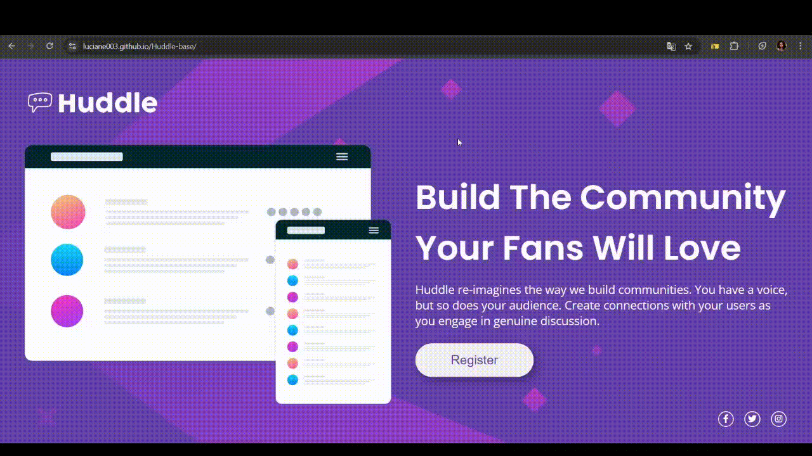

# Huddle-base 🤝

## Descrição
Esta é uma página visual desenvolvida com foco em acessibilidade e acolhimento.
Ao chegar, você é recebido com uma mensagem de boas-vindas e tem a opção de se registrar rapidamente. Após o registro, é possível acessar uma comunidade onde todas as vozes são ouvidas e valorizadas.
No rodapé, estão disponíveis canais de contato para quem desejar mais informações ou queira conversar diretamente.

## Demonstração
Acesse a versão online do projeto
[Link do projeto](https://luciane003.github.io/Huddle-base/)

## Funcionalidades
- Layout responsivo
- Seção de boas vindas
- Botão de registro
- Rodapé com informações de contato

## Tecnologias utilizadas

  
  

 

## Como visualizar o projeto localmente
### Clone o repositório
git clone https://github.com/luciane003/Huddle-base.git
### Abra o arquivo index.html no navegador

## Autor
- Luciane Kellen
- [LinkedIn](https://www.linkedin.com/in/luciane-kellen-bb8279342/?trk=opento_sprofile_details)
- Feito como parte do meu processo de aprendizado em desenvolvimento frontend.

## Visualização

